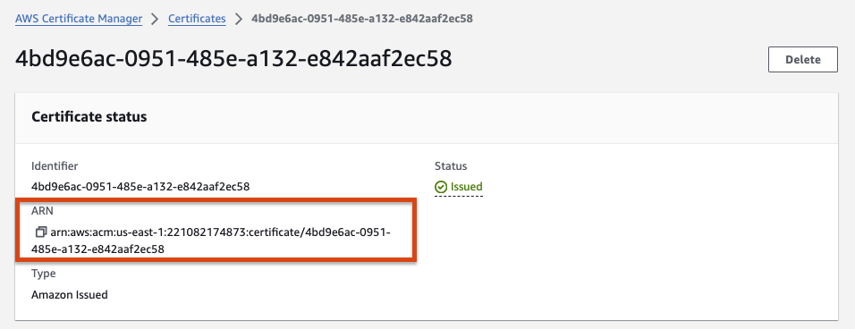

# Schematic AWS CDK app

AWS CDK app for deploying [Schematic](schematic.api.sagebionetworks.org).

# Prerequisites

AWS CDK projects require some bootstrapping before synthesis or deployment.
Please review the [bootstapping documentation](https://docs.aws.amazon.com/cdk/v2/guide/getting_started.html#getting_started_bootstrap)
before development.

# Dev Container

This repository provides a [dev container](https://containers.dev/) that includes all the tools
required to develop this AWS CDK app.

## Opening the project inside its dev container

With VS Code:

1. Clone this repo
2. File > Open Folder...
3. A prompt should invite you to open the project inside the dev container. If not, open VS Code
    Command Palette and select "Dev Containers: Open Folder in Container..."

With GitHub Codespaces:

1. From the main page of this repository, click on the button "Code" > Codespaces > Click on the
   button "Create codespace"

That's it! You are now inside the dev container and have access to all the development tools.

# Development

All the development tools are provided when developing inside the dev container
(see above). These tools include Python, AWS CLI, AWS CDK CLI, etc. These tools
also include a Python virtual environment where all the Python packages needed
are already installed.

If you decide the develop outside of the dev container, some of the development
tools can be installed by running:

```console
./tools/setup.sh
```

Development requires the activation of the Python virtual environment:

```
$ source .venv/bin/activate
```

At this point you can now synthesize the CloudFormation template for this code.

```
$ cdk synth
```

To add additional dependencies, for example other CDK libraries, just add
them to your `setup.py` file and rerun the `pip install -r requirements.txt`
command.

## Useful commands

 * `cdk ls`          list all stacks in the app
 * `cdk synth`       emits the synthesized CloudFormation template
 * `cdk deploy`      deploy this stack to your default AWS account/region
 * `cdk diff`        compare deployed stack with current state
 * `cdk docs`        open CDK documentation


# Testing

## Static Analysis

As a pre-deployment step we syntactically validate the CDK json, yaml and
python files with [pre-commit](https://pre-commit.com).

Please install pre-commit, once installed the file validations will
automatically run on every commit.  Alternatively you can manually
execute the validations by running `pre-commit run --all-files`.

Verify CDK to Cloudformation conversion by running [cdk synth]:

```console
ENV=dev cdk synth
```

The Cloudformation output is saved to the `cdk.out` folder

## Unit Tests

Tests are available in the tests folder. Execute the following to run tests:

```
python -m pytest tests/ -s -v
```


# Environments

An `ENV` environment variable must be set when running the `cdk` command tell the
CDK which environment's variables to use when synthesising or deploying the stacks.

Set environment variables for each environment in the [app.py](./app.py) file:

```python
environment_variables = {
    "VPC_CIDR": "10.254.192.0/24",
    "FQDN": "dev.schematic.io",
    "CERTIFICATE_ARN": "arn:aws:acm:us-east-1:XXXXXXXXXXX:certificate/0e9682f6-3ffa-46fb-9671-b6349f5164d6",
    "TAGS": {"CostCenter": "NO PROGRAM / 000000"},
}
```

For example, synthesis with the `prod` environment variables:

```console
ENV=prod cdk synth
```

# Certificates

Certificates to set up HTTPS connections should be created manually in AWS certificate manager.
This is not automated due to AWS requiring manual verification of the domain ownership.
Once created take the ARN of the certificate and set that ARN in environment_variables.



# Secrets

Secrets can be manually created in the
[AWS Secrets Manager](https://docs.aws.amazon.com/secretsmanager/latest/userguide/create_secret.html).
When naming your secret make sure that the secret does not end in a pattern that matches
`-??????`, this will cause issues with how AWS CDK looks up secrets.

To pass secrets to a container set the secrets manager `container_secrets`
when creating a `ServiceProp` object. You'll be creating a list of `ServiceSecret` objects:
```python
from src.service_props import ServiceProps, ServiceSecret

app_service_props = ServiceProps(
    container_name="app",
    container_port=443,
    container_memory=1024,
    container_location="ghcr.io/sage-bionetworks/app:v1.0",
    container_env_vars={},
    container_secrets=[
        ServiceSecret(
            secret_name="app/dev/DATABASE",
            environment_key="NAME_OF_ENVIRONMENT_VARIABLE_SET_FOR_CONTAINER",
        ),
        ServiceSecret(
            secret_name="app/dev/PASSWORD",
            environment_key="SINGLE_VALUE_SECRET",
        )
    ]
)
```

For example, the KVs for `app/dev/DATABASE` could be:
```json
{
    "DATABASE_USER": "maria",
    "DATABASE_PASSWORD": "password"
}
```

And the value for `app/dev/PASSWORD` could be: `password`

In the application (Python) code the secrets may be loaded into a dict using code like:

```python
import json
import os

all_secrets_dict = json.loads(os.environ["NAME_OF_ENVIRONMENT_VARIABLE_SET_FOR_CONTAINER"])
```

In the case of a single value you may load the value like:

```python
import os

my_secret = os.environ.get("SINGLE_VALUE_SECRET", None)
```


> [!NOTE]
> Retrieving secrets requires access to the AWS Secrets Manager

# Deployment

## Bootstrap

There are a few items that need to be manually bootstrapped before deploying the application.

* Add secrets to the AWS Secrets Manager
* Create an [ACM certificate for the application](#Certificates) using the AWS Certificates Manager
* Update environment_variables in [app.py](app.py) with variable specific to each environment.
* Update references to the docker images in [app.py](app.py)
  (i.e. `ghcr.io/sage-bionetworks/app-xxx:<tag>`)
* (Optional) Update the `ServiceProps` objects in [app.py](app.py) with parameters specific to
  each container.

## Login with the AWS CLI

> [!NOTE]
> This and the following sections assume that you are working in the AWS account
> `org-sagebase-itsandbox` with the role `Developer` and that you are deploying
> to the `us-east-1` region. If this assumption is correct, you should be able
> to simply copy-paste the following commands, otherwise adapting the
> configuration should be straightforward.

Create the config file if it doesn't exist yet.

```console
mkdir ~/.aws && touch ~/.aws/config
```

As a Developer working in Sage IT Sandbox AWS account, add the following profile to the config file.

```ini
[profile itsandbox-dev]
sso_start_url = https://d-906769aa66.awsapps.com/start
sso_region = us-east-1
sso_account_id = XXXXXXXXX
sso_role_name = Developer
```

Login with the AWS CLI:

```console
aws --profile itsandbox-dev sso login
```


## Deploy

Deployment requires setting up an [AWS profile](https://docs.aws.amazon.com/cli/latest/userguide/getting-started-quickstart.html)
then executing the following command:

```console
AWS_PROFILE=itsandbox-dev AWS_DEFAULT_REGION=us-east-1 ENV=dev cdk deploy --all
```

## Force new deployment

```console
AWS_PROFILE=itsandbox-dev AWS_DEFAULT_REGION=us-east-1 aws ecs update-service \
  --cluster <cluster-name> \
  --service <service-name> \
  --force-new-deployment
```

# Execute a command from a container running on ECS

Once a container has been deployed successfully it is accessible for debugging using the
[ECS execute-command](https://docs.aws.amazon.com/cli/latest/reference/ecs/execute-command.html)

Example to get an interactive shell run into a container:

```console
AWS_PROFILE=itsandbox-dev AWS_DEFAULT_REGION=us-east-1 aws ecs execute-command \
  --cluster AppEcs-ClusterEB0386A7-BygXkQgSvdjY \
  --task a2916461f65747f390fd3e29f1b387d8 \
  --container app-mariadb \
  --command "/bin/sh" --interactive
```


# CI Workflow

This repo has been set up to use Github Actions CI to continuously deploy the application.

The workflow for continuous integration:

* Create PR from the git dev branch
* PR is reviewed and approved
* PR is merged
* CI deploys changes to the dev environment (dev.app.io) in the AWS dev account.
* Changes are promoted (or merged) to the git stage branch.
* CI deploys changes to the staging environment (stage.app.io) in the AWS prod account.
* Changes are promoted (or merged) to the git prod branch.
* CI deploys changes to the prod environment (prod.app.io) in the AWS prod account.

# Creation/Forwarding of OpenTelemetry data
Schematic has been instrumented with a mix of
[automationally instrumented libraries](https://github.com/open-telemetry/opentelemetry-python-contrib/tree/main/instrumentation)
and [manual traces](https://opentelemetry-python.readthedocs.io/en/latest/api/trace.html).
In addition it's been configured at startup to [conditionally turn on trace/log exports](https://github.com/Sage-Bionetworks/schematic/blob/778bf54db9c5b4de0af334c4efe034b3dde0b348/schematic/__init__.py#L82-L139)
depending on how a few environment variables are set. The combination of all these lets
the schematic container running in ECS export telemetry data out of the container to be
ingested somewhere else for long-term storage.


Schematic is configured to send it's telemetry data to the OpenTelemetry Collector
which then handles forwarding that data on to it's final destination. This is
accomplished by setting a few environment variables on the Schematic container such as:

```python
from src.service_props import ServiceProps

telemetry_environment_variables = {
    "TRACING_EXPORT_FORMAT": "otlp",
    "LOGGING_EXPORT_FORMAT": "otlp",
    "TRACING_SERVICE_NAME": "schematic",
    "LOGGING_SERVICE_NAME": "schematic",
    "DEPLOYMENT_ENVIRONMENT": environment,
    "OTEL_EXPORTER_OTLP_ENDPOINT": "http://otel-collector:4318",
}

app_service_props = ServiceProps(
    container_name="schematic-app",
    container_location="ghcr.io/sage-bionetworks/app:v1.0"
    container_port=443,
    container_memory=1024,
    container_env_vars=telemetry_environment_variables,
)
```


## OpenTelemetry Collector
The OpenTelemetry collector is deployed into ECS and is running in
[Gateway mode](https://opentelemetry.io/docs/collector/deployment/gateway/). This
configuration allows for a single collector to be the central point for all telemetry
data leaving the context of this deployed infrastructure. This central point allows us
to configure where [authorization can be attached](https://github.com/open-telemetry/opentelemetry-collector-contrib/tree/main/extension/oauth2clientauthextension),
[requests batched up](https://github.com/open-telemetry/opentelemetry-collector/blob/main/processor/batchprocessor/README.md), or [sensitive data be stripped](https://docs.honeycomb.io/send-data/opentelemetry/collector/handle-sensitive-information/).


The configuration of all of these elements stems from [supplying a `config.yaml` file](https://opentelemetry.io/docs/collector/configuration/) as
an environment variable to the otel collector container at startup. This config file is
set up to be sourced from AWS Secrets manager. To accomplish this a filled out copy of
the following configuration file is stored in AWS Secrets manager (As Plaintext)
with the name `f"{stack_name_prefix}-DockerFargateStack/{environment}/opentelemetry-collector-configuration"`:

```
extensions:
  health_check:
    endpoint: "0.0.0.0:13133"
    path: "/"
    check_collector_pipeline:
      enabled: true
      interval: "5m"
      exporter_failure_threshold: 5
  oauth2client:
    client_id: FILL_ME_IN
    client_secret: FILL_ME_IN
    endpoint_params:
      audience: FILL_ME_IN
    token_url: FILL_ME_IN
    # timeout for the token client
    timeout: 2s

receivers:
  otlp:
    protocols:
      http:
        endpoint: 0.0.0.0:4318

processors:
  batch:
    send_batch_size: 50

exporters:
  otlphttp/withauth:
    endpoint: FILL_ME_IN
    auth:
      authenticator: oauth2client

service:
  pipelines:
    traces:
      receivers: [otlp]
      processors: [batch]
      exporters: [otlphttp/withauth]
    logs:
      receivers: [otlp]
      processors: [batch]
      exporters: [otlphttp/withauth]
  extensions: [health_check, oauth2client]
```
